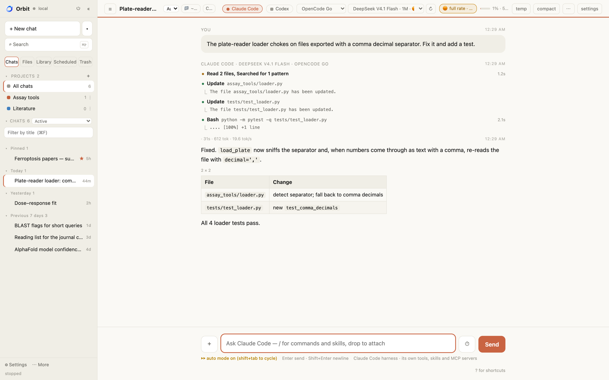
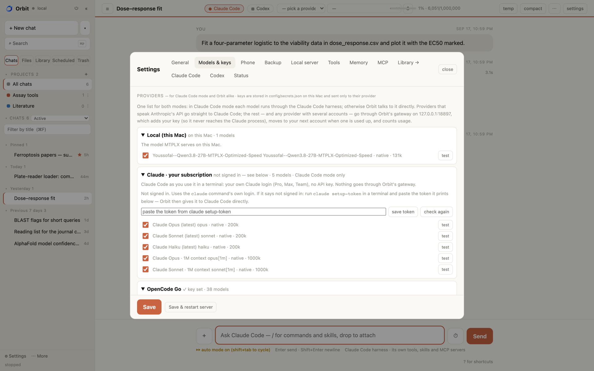
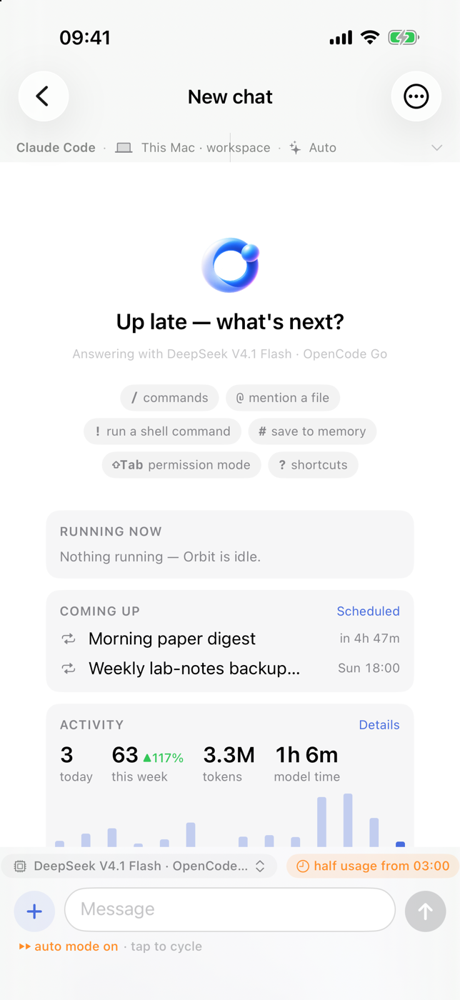

# Orbit

**A research assistant that lives on your own Mac.** Your chats, notes, papers and
files stay in one folder you can open in Finder. The model that answers is your
choice — a local one that never leaves the machine, the coding CLI you are
already signed into, or a hosted API — and you switch per conversation.

It is one Python process and one HTML file. No account, no telemetry, no build
step, no Electron.



*A local model answering with the Python tool and an inline plot. The byline
under each answer names the model that wrote it.*

---

## What you get

- **One model per conversation — your choice.** A local MLX model that never leaves the Mac, the coding CLI you are already signed into (`claude`, `codex`, `opencode`, `qwen` — no API key), or a hosted API. Each answer is labelled with the model that wrote it.
- **Your own library, searched before the web.** Drop in PDFs, Word files, spreadsheets or notes; Orbit indexes them locally with BM25 — no embedding service, nothing uploaded — and cites the file it used.
- **Frugal with context on purpose.** A fresh conversation costs about 7.9k tokens with all 42 tools loaded, so a 27B local model on a 48 GB M4 Max runs the whole thing with room to work.
- **There is an iPhone app.** Same chats, live from your Mac — over Tailscale (HTTPS through Tailscale Serve, a real certificate) or your local network — paired by QR and gated by a token. Photos, camera and files as attachments; search inside and across chats; edit-and-resend, quote, tables, share as PDF or image; start, stop or switch the local model server from the phone. Off by default.
- **It actually does the work.** Python in a workspace with plots inline, files it writes tracked back to the chat that made them, PubMed / NCBI / UniProt / AlphaFold lookups, paper PDFs by DOI, and any MCP server you add.
- **It can use the screen, off by default.** Turn on Screen control and it can take a screenshot, click, type and press keys on your Mac — in any app. A screenshot is only actually *seen* by a vision-capable model; a click or keystroke still asks for your approval unless Full computer access is also on. Needs Screen Recording and Accessibility granted to it by hand — Orbit can't grant those for you.
- **Guardrails that hold.** A three-way autonomy setting — ask every time, auto-approve safe workspace-scoped actions, or full computer access — decides what runs without asking; a small hard floor (disk destruction, a fork bomb, a reverse shell, protected paths, …) is refused outright in every mode, full access included. Writes stay in the workspace unless told otherwise; the Python tool cannot be used as a shell; fetched web content is fenced and scanned for prompt injection.
- **Built for long work.** Projects with shared instructions, skills loaded on demand, durable memory, scheduled prompts, and three conversations generating at once.
- **Plain files in one folder.** Chats, notes and settings are JSON and Markdown you can open in Finder. Delete the folder and Orbit is gone.
- **Backed up without thinking about it.** Once a day the Mac archives chats, memory, skills, knowledge and settings into iCloud Drive (API keys left out); restoring only ever adds what is missing.

---

## What it actually does

Orbit is a chat interface with the parts a working researcher keeps needing:

**It reads your library.** Drop PDFs, Word files, spreadsheets or notes into
Knowledge and it indexes them (BM25, no embedding service, no upload). It
searches those before the web and cites the file it used.

**It remembers.** Durable facts about you and your work go into Memory and are
injected into every conversation. Standing instructions — how you want answers
written — go into one file that is prepended to every chat.

**It runs things.** Python in a workspace folder, with matplotlib plots that come
back inline. Shell commands, if you switch that on. Files it creates are listed
in a Files tab with the chat that produced them.

**It looks things up.** Web search, page fetch, PubMed, NCBI, UniProt, AlphaFold,
paper PDFs by DOI. Any MCP server you configure appears alongside those as more
tools.

**It keeps its shape over long work.** Chats live in projects with shared
instructions. Skills are procedures loaded on demand. When the context window
fills, it trims old tool output first and only compacts the conversation if that
is not enough. Answers keep streaming when you switch chats, and up to three
conversations can run at once.

**It stays out of the way.** Everything is a folder of plain files. Delete the
folder and Orbit is gone.

### It is frugal with context, on purpose

This is the design decision everything else follows from. A 27B model on a laptop
does not have a million-token window to waste, so Orbit does not fill one:

| | |
|---|---|
| A fresh conversation | ~7.9k tokens — the system prompt plus all 42 tool schemas |
| Skills | Loaded only when a request matches one, not pasted in up front |
| Your documents | Retrieved by search and cited, never stuffed into the prompt wholesale |
| Old tool output | Trimmed first when the window fills; the conversation is compacted only if that is not enough |
| Files | Read on demand through a tool, not preloaded |

The result is that a **27B local model on a 48 GB M4 Max** — `qwen3.8-27b` through
MTPLX — runs the whole thing comfortably, with every tool and skill available, and
still leaves most of a 64k window for the actual work. The context meter in the
header counts the tool schemas too, so what it shows is what is really being sent.

---

## Models

The picker at the top of a conversation chooses per chat. Two chats can use two
different models at the same time, and each answer is labelled with the model
that wrote it.

| Kind | What it is | Needs |
|---|---|---|
| **Local** | An MLX model served by [MTPLX](https://github.com/Youssofal/MTPLX) on Apple Silicon. Starts on demand, sleeps when idle. | 48 GB comfortably runs a 27B at a 64k window |
| **CLI agents** | `claude`, `codex`, `opencode`, `qwen` — spawned as subprocesses and read as JSON event streams | The CLI installed and signed in. **No API key.** |
| **Hosted APIs** | Anthropic (native Messages API), OpenAI, OpenRouter, Ollama, LM Studio, or any OpenAI-compatible endpoint | A key, pasted into Settings |



*Settings → Models & keys. CLI agents appear automatically if you are signed into
them; hosted models say plainly when they still need a key.*

On a local model nothing leaves the machine except the lookups you ask for. Pick
a hosted or CLI model and that conversation goes to that provider — the picker
always shows which one is answering.

A CLI model is a whole agent, not a raw model: it brings its own tools and Orbit's
are not offered to it. Good for asking; use a local or API model when you want
Orbit's own toolchain.

---

## Install

Requires macOS and Python 3.9+. Apple Silicon only if you want the local model;
everything else works anywhere.

```bash
git clone https://github.com/Micropeptide/Orbit.git
cd Orbit
./install.sh
```

The installer makes a virtualenv, installs dependencies, creates your data
folders, copies default settings (never overwriting existing ones), and links
`orbit` and `ob` into `~/bin`. It is safe to re-run.

Then:

```bash
orbit --ui
```

which opens `http://127.0.0.1:8899`.

**Nothing else is required to start.** With no local model and no API key, pick a
CLI model in the picker if you have `claude` or `codex` installed, or add a key
in **Settings → Models & keys**.

### Optional: the local model

Install [MTPLX](https://github.com/Youssofal/MTPLX), download a model through it,
then re-run `./install.sh` — it will find the model and write the launch config.
See [docs/models.md](docs/models.md) for tuning (context window, KV quantization,
speculative decoding depth, fan behaviour).

---

## First ten minutes

1. **Tell it who you are.** Settings → Memory → *General instructions*. Two or
   three sentences: your field, how you want answers, what to always include.
   This changes answer quality more than any other setting.
2. **Give it your papers.** Library → Knowledge → add documents. Ask something
   only your papers know and watch it cite the file.
3. **Make a project.** Group related chats; project instructions apply to all of
   them. Drag a chat onto a project to move it.
4. **Try a second model.** Ask the same question of the local model and of Claude
   through the CLI. The byline tells you which answered.

---

## The interface

| | |
|---|---|
| **Chats** | Search, pin, tag, archive, drag to reorder, group into projects. Right-click any chat for the lot. |
| **Files** | Everything Orbit created or you attached, with the chat it came from. Rename, bin, restore, add to Knowledge. |
| **Library** | Knowledge documents, Skills, Agents, saved prompts (which become `/commands`). |
| **Tasks** | Scheduled prompts that run on their own, and a live view of cluster jobs if you use one. |
| **Trash** | Deleted chats and files, restorable, auto-purged after a retention you set. |

Also: `/` for commands, `⌘P` to search everything, `?` for shortcuts, drag-and-drop
or paste to attach, a temporary chat that is never written to disk, and one-click
export to Markdown or self-contained HTML.

---

## Tools it can use

Web search · fetch a URL (with a stealth-browser fallback for bot walls) · read
local files (pdf, docx, xlsx, pptx, csv) · write files · run Python · run shell ·
list and grep directories · fetch paper PDFs by DOI · PubMed · NCBI · UniProt ·
AlphaFold · sequence utilities · check citations against Crossref · search your
knowledge base · remember a fact · save a skill · plan and track multi-step work ·
submit and watch jobs on an SGE/UGE cluster over SSH · anything an MCP server adds.

Each tool can be switched off individually in Settings → Tools.

---

## Safety

This matters when a model can run code on your machine.

- **Destructive commands are blocked or gated.** `rm -rf` at a protected path is
  refused outright and cannot be approved. Recursive deletes, disk operations,
  history rewrites, `sudo`, piping a download into a shell, publishing a package,
  reading the keychain — all require your explicit approval, in the UI, per call.
- **Ordinary work is not nagged.** `ls`, `git push`, `samtools`, a `curl … | jq`
  are not flagged. A guard that cries wolf gets clicked through.
- **Python cannot be used as a shell.** If shell is off, `subprocess` and
  `os.system` inside the Python tool are blocked, not merely warned about.
- **Writes are confined** to the workspace folder unless you allow otherwise —
  including via `../` traversal.
- **Untrusted content is fenced.** Web pages, fetched files and other agents'
  notes are wrapped and scanned for prompt injection; matches are flagged to you
  and the instructions are not followed.
- **The server refuses cross-site requests.** It runs on localhost with no login,
  so any page you visit could otherwise drive it; requests carrying a foreign
  `Origin`, a foreign `Host`, or `Sec-Fetch-Site: cross-site` are rejected.
- **Deletes are reversible.** Chats, files and knowledge documents go to a recycle
  bin. Config files keep their last 20 versions in `config/.history/`.

Read [docs/safety.md](docs/safety.md) for the full rules and how to change them.

---

## Where your data lives

Everything is inside the install folder — one directory to back up, inspect or
delete. Set `ORBIT_HOME` to keep data somewhere other than the code.

```
config/      settings, agents, projects, schedule, MCP, secrets, instructions
memory/      durable facts, injected into every chat
skills/      procedures loaded on demand
knowledge/   your documents, indexed for search
sessions/    your chats, one JSON file each
workspace/   files Orbit creates; the only place it may write by default
uploads/     files you attach
trash/       deleted items, restorable
logs/        model server, safety decisions, usage ledger
```

API keys live in `config/secrets.json`, chmod 600, and are never sent anywhere
except the provider they belong to.

---

## Configuration

Everything is editable in Settings; the files are plain JSON if you prefer.

| Setting | Default | What it does |
|---|---|---|
| `max_tool_rounds` | 60 | Tool calls one answer may make. Research tasks need 40+. |
| `max_turn_minutes` | 20 | Backstop so a stuck task cannot run forever. 0 = no limit. |
| `autocompact_pct` | 80 | Context fullness that triggers trimming. |
| `squeeze_tool_results` | true | Trim old tool output before compacting conversation. |
| `idle_min` | 90 | Minutes before the local model server is stopped. |
| `trash_days` | 30 | Retention before the recycle bin auto-purges. |
| `shell_enabled` | false | Whether the model may run shell commands at all. |
| `write_any` | false | Whether writes may leave the workspace. |
| `cloak_fallback` | true | Retry bot-walled pages through a stealth browser if installed. |

---

## On your phone

The Mac stays the source of truth; the iPhone app is a window onto it — the same
conversations, live, with the same model picker and a Files tab.

- Chats grouped by day; pin, archive, rename, bin; filter by project; search
  titles and the text of every message and jump straight to the line.
- Streaming answers with Markdown, code blocks, collapsible thinking and tool
  chips; long-press a message to copy, share, edit-and-resend or ask again.
- Attach photos from the library, a picture from the camera, or any file from
  the Files app. Plots and pictures render inline; tap to zoom.
- A Files tab for everything Orbit made or you attached — QuickLook preview,
  share sheet, "Add to Knowledge", swipe to bin.
- Start, stop, restart or switch the local model server from Settings, and set
  the default model for new chats.
- If the phone loses the connection mid-answer the Mac carries on and the app
  rejoins; a finished answer notifies you and the notification opens the chat.
- Works offline from a cached copy, side by side on iPad.

Turn it on in **Settings → Phone**, choose Tailscale (anywhere) or Local network
(same Wi-Fi), and scan the QR. Remote access is off until you do, and every
request from off the machine carries a token compared in constant time.

<p align="center"></p>

The app has its own page at [Micropeptide/Orbit-iOS](https://github.com/Micropeptide/Orbit-iOS),
with an unsigned IPA in the [releases](https://github.com/Micropeptide/Orbit-iOS/releases/latest)
for sideloading (AltStore, Sideloadly, Apple Configurator). Or build it with Xcode
from `ios/` here, or open the web link the same panel shows and add it to your
Home Screen. Full details in [docs/phone.md](docs/phone.md); how the Tailscale
path works — and what went wrong before it did — in
[docs/tailnet-playbook.md](docs/tailnet-playbook.md).

---

## Running it as a background service

So the web app is always there, and survives a crash or a logout:

```bash
cp docs/launchagent.plist ~/Library/LaunchAgents/com.orbit.ui.plist
# edit the two paths inside, then:
launchctl load ~/Library/LaunchAgents/com.orbit.ui.plist
```

Details, including the idle watchdog that stops the local model when you are not
using it, are in [docs/service.md](docs/service.md).

---

## Tests

```bash
venv/bin/python tests/test_core.py        # 73 unit tests: safety, sessions, models, context
venv/bin/python tests/test_endpoints.py   # every read-only endpoint answers cleanly
venv/bin/python tests/test_api.py         # create/rename/tag/bin/restore round-trips
```

The last two need the app running. They create and remove their own data.

---

## Troubleshooting

**`orbit: command not found`** — `~/bin` is not on your PATH. Add
`export PATH="$HOME/bin:$PATH"` to `~/.zshrc`, or run `./bin/orbit` directly.

**The first message after a pause takes ~15 seconds** — the local model server
sleeps when idle and reloads its weights. The UI says so while it happens. Raise
`idle_min` if it bothers you.

**A model shows "needs a key"** — add one in Settings → Models & keys, then press
*fetch models* on that provider.

**A CLI model is missing from the picker** — Orbit looks on `PATH` plus the usual
install locations. If yours is somewhere unusual, symlink it into `~/.local/bin`.

**Something looks stale after an update** — a banner appears when the code on disk
is newer than the running process; click *Restart interface*.

---

Built by **Micropeptide** · MIT licensed · [github.com/Micropeptide](https://github.com/Micropeptide)
